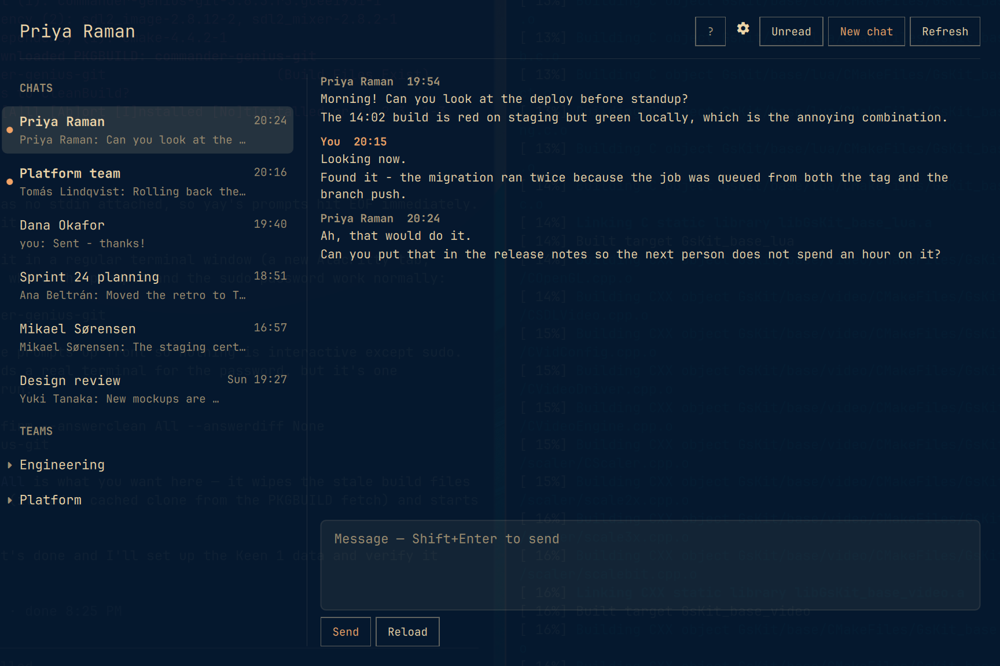
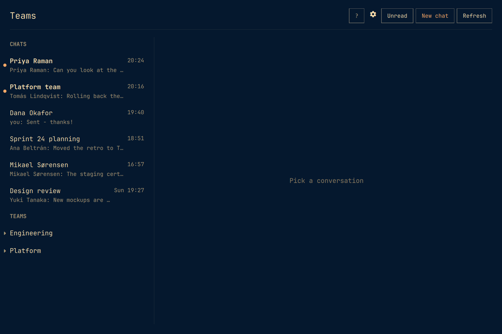

# Microsoft Teams for Omarchy

Teams chats and channels in the Omarchy bar, and in a window of their own.

- **A bar icon** that tints when a chat is unread, with a tooltip naming the account and the count.
- **A window** — a real Hyprland toplevel, tiled like anything else — with conversations on the left, the transcript on the right, and a box to answer in. Bound to `SUPER+G`, also on the Omarchy menu under *Teams*.
- **Chats and channels.** One-to-one chats, group chats, and the channels of every team you have joined.
- **Replying**, to a chat or a channel. `Shift+Enter` or `Ctrl+Enter` sends; plain `Enter` is a newline, because a chat box that sends on Enter posts half-written thoughts.
- **Starting a chat** with anybody in the directory, and **marking a chat read** by opening it.
- **Emoji, inline images and clickable links** in the transcript.
- **Reactions.** The ones already on a message, counted, with yours marked - click a chip to add or remove yours, or `+` to pick from the six Teams takes.
- **Keyboard first.** The whole window drives from the keyboard — see below, or press `?` in the window.





Python 3 standard library only. It talks to Microsoft Graph and nothing else. No token ever reaches the QML: `src/teams.py` holds them, and the shell reads JSON from it.

## Installing

```
omarchy plugin add https://github.com/janrenz/omarchy-teams.git --enable
omarchy bar set janrenz.omarchy.teams clientId <your-application-client-id>
```

The client id is not optional, and no default could stand in for it: the sign-in goes against an app registration of yours, described below. Reload the shell afterwards and the icon is in the bar.

Nothing outside the plugin's own directory is written on install, and no configuration of yours is overwritten — the settings live in the widget's own entry in `~/.config/omarchy/shell.json`, alongside whatever else is already in there.

## Removing

```
omarchy plugin remove janrenz.omarchy.teams
```

That takes the plugin off the disk. Three things of yours live outside it and are deliberately left behind — delete them yourself if you want them gone:

| Path | What is in it |
|---|---|
| `~/.config/omarchy/shell.json` | Your settings, in the widget's entry. |
| `~/.local/state/omarchy/teams/` | The tokens. Delete this to sign out. |
| `~/.cache/omarchy/teams/images/` | Images already fetched from Graph. |

The app registration in Azure is yours and is untouched either way; delete it in the portal if you are done with it.

## Keyboard

Press `?` in the window for this same list. Omarchy is keyboard-first, so the
window is a focus ladder rather than a bag of shortcuts: **list → conversation
→ message box**. `h` and `l` step between the rungs, `Escape` walks back out
one rung at a time, and `j`/`k` always mean "down and up in whatever has
focus".

### Moving

| Key | What it does |
|---|---|
| `j` / `k`, `↓` / `↑` | Down and up in whatever has focus — the list's cursor, or the transcript |
| `Enter` | Open the conversation under the cursor, and move focus into it |
| `h` / `←` | Back to the list, **leaving the conversation open**. Narrow windows slide the list out over it |
| `l` / `→` | Into the conversation; again into the message box |
| `Tab` or `i` | Straight to the message box |
| `Escape` | Back one step: message box → conversation → list → close the conversation → close the window |

Escape never skips a rung. Going back to the list does not close what you were
reading, which is the step that used to be missing.

### Scrolling

| Key | What it does |
|---|---|
| `Page Up` / `Page Down` | A screenful of whatever has focus |
| `Ctrl-u` / `Ctrl-d` | Half a screen |
| `Ctrl-b` / `Ctrl-f` | A screen |
| `g` / `G` | To the top / to the newest |
| `Home` / `End` | The same as `g` / `G` |

### Doing

| Key | What it does |
|---|---|
| `Shift+Enter` or `Ctrl+Enter` | Send. Plain `Enter` is a newline |
| `u` | Show only unread conversations |
| `n` | Start a new chat |
| `r` | Reload the open conversation |
| `,` | Settings |
| `?` | This list |

Opening the window itself is `SUPER+G`, or *Teams* in the Omarchy menu.

## You need your own Azure app registration

This is the one part nobody can do for you, and it is not optional.

An Azure app registration declares up front which delegated permissions it is allowed to request. A registration set up for mail therefore *cannot* ask for `Chat.Read` — the consent screen refuses before you ever see it. So unlike the Office 365 mail plugin, this one ships no default client id.

1. Go to **Azure Portal → Microsoft Entra ID → App registrations → New registration**.
2. Name it whatever you like. Under *Supported account types* pick **Accounts in this organizational directory only** unless you know you need otherwise. Leave the redirect URI empty.
3. Open the new registration → **Authentication** → *Advanced settings* → set **Allow public client flows** to **Yes**. This is what enables the device-code sign-in. Save.
4. Go to **API permissions → Add a permission → Microsoft Graph → Delegated permissions** and add:

   | Permission | For | Consent |
   |---|---|---|
   | `User.Read` | knowing who you are | user |
   | `Chat.ReadWrite` | reading your chats, and marking one read by opening it | user |
   | `Chat.Create` | starting a new chat | user |
   | `ChatMessage.Send` | replying in a chat | user |
   | `People.Read` | finding the people you talk to | user |
   | `User.ReadBasic.All` | finding everybody else | user |
   | `Team.ReadBasic.All` | listing your teams | user |
   | `Channel.ReadBasic.All` | listing their channels | user |
   | `ChannelMessage.Read.All` | reading channel messages | **admin** |
   | `ChannelMessage.Send` | posting in a channel | user |

   `Chat.ReadWrite` rather than `Chat.Read` on purpose: marking a chat read is
   a write, and `markChatReadForUser` refuses anything less. Everything in that
   list except the channel row is ordinary user consent.

5. Copy the **Application (client) ID**.
6. In Omarchy, open the Teams widget's settings and fill in **Account name** (a short label such as `work`) and **Azure client id**.
7. Open the window (`SUPER+G`) and press **Sign in**. Enter the code it shows at the URL it gives you.

### If channels are refused

`ChannelMessage.Read.All` normally needs an administrator to consent for the whole tenant. A device-code sign-in asking for it either gets everything or fails outright — it does not partly succeed. That is why the scopes are split in two:

- **Include teams and channels** off → asks only for the chat scopes, which any user can grant themselves.
- On → also asks for the channel scopes.

If the sign-in fails complaining about consent, either ask an admin to grant it, or turn the setting off and sign in for chats alone. The window has a *Sign in for chats only* button for exactly this, and says **chats only** in its header afterwards so you know why there are no teams listed. An **Add channels…** button re-runs the wider sign-in later if the grant arrives.

What the tenant actually granted is recorded from the token response rather than assumed from what was requested — an admin can withhold one scope and grant the rest, and the window hides the teams column instead of showing one that 403s on every click.

## Settings

Open the window (`SUPER+G`) and press the gear, or `,`. The form writes into
the widget's entry in `~/.config/omarchy/shell.json`; `omarchy bar set
janrenz.omarchy.teams <key> <value>` does the same thing from a terminal.

Nothing in the shell renders a settings form for a third-party bar widget - a
manifest schema is declared, but the only reference to it anywhere in the
shell is the line that writes it into the registry - so the plugin brings its
own.

| Key | Default | What it does |
|---|---|---|
| `account` | — | Short name for this sign-in. Letters, numbers, dot, dash, underscore. |
| `clientId` | — | **Required.** Your app registration's Application (client) ID. |
| `authority` | `common` | `common`, `organizations`, or your tenant id. |
| `channels` | `true` | Whether to ask for team and channel access at sign-in. |
| `chats` | `25` | How many chats to list (1–40). |
| `density` | `cosy` | How much room the window gives things: `compact`, `cosy`, `roomy`, `spacious`. A multiplier over the theme's own spacing, so it follows your font size rather than fighting it. |
| `refreshIntervalSec` | `120` | How often to poll (30–3600). |
| `icon` / `label` | `󰊻` | Bar glyph, or text instead of it. |
| `tintOnUnread` | `true` | Highlight the bar icon while a chat is unread. |
| `notify` | `true` | Desktop notification when a chat has something new in it. |

## Notifications

A chat with something new in it raises a desktop notification: the chat's name, and a line of what was said. More than three arriving in one poll become a single summary instead of a stack.

What counts as new is *new since the shell started watching*, not *unread*. The first answer after a sign-in — or after a laptop wakes up to a morning of messages — is an entire backlog at once, and announcing all of it is what makes people turn notifications off for good. So the first poll of an account primes quietly and only what turns up after it is announced. Nothing you sent yourself is announced either: Graph leaves a chat you just spoke in unread until the read mark catches up.

They are raised from behind the bar icon, not from the window, so they arrive whether or not the window is open — and only once, though both have a service of their own polling the same account.

## What it does not do

- **Only the six reactions Teams offers.** 👍 ❤️ 😂 😮 😢 😡. Graph refuses anything else with "Unicode ... is not supported", so the picker offers exactly what will work rather than letting you pick something that silently fails.
- **No unread counts for channels.** Graph will say whether a *chat* has been read since its last message, but exposes nothing equivalent for channels. Rather than invent a number, channels carry no unread mark at all.
- **Teams are closed until opened.** Their channels are one request per team; listing all of them up front cost 29 requests and two hundred rows on an account in 28 teams.
- **No live updates.** It polls on the interval above. Graph change notifications need a public webhook endpoint, which a desktop shell has no business running.
- **A message never chooses its own markup.** A Teams message is HTML written by whoever sent it, and Qt's rich text fetches what it is told to fetch. So the markup is flattened in `teams.py`, and the only tag the window ever builds is an `<a>` around a link it found in text it escaped first. Emoji come from the character Teams already puts in the tag's `alt`.
- **Images are fetched by the helper, never by the window.** They live behind the Graph API and need your token; the host is checked before that token is attached, so an `` in a message cannot be used to collect it. Anything not on `graph.microsoft.com` is dropped from the message entirely.
- **No unread counts for channels**, no live updates (it polls), and no attachments, reactions, threads or presence.

## Development

```
dev/link.sh          # stage the QML where Quickshell can import qs.Commons
python3 dev/test-teams.py                           # the helper: parsing, permission, hosts
node dev/test-model.js                              # the shaping the window binds to
python3 src/teams.py fetch --account work --demo    # synthetic data, no sign-in
```

`--demo` works through the whole plugin, so the layout can be built without a mailbox or a tenant. Every read is answered from the fixtures in `src/teams.py`, and every write — sending, starting a chat, marking read — returns as if it had happened and posts nothing. That is what makes it safe to drive the window automatically.

### The showcase images

```
dev/showcase.sh [outdir]     # regenerate showcase-*.png and preview.png in the repo root
```

It saves your `shell.json`, installs one demo widget in place of yours, photographs the window, and puts your configuration back — including on failure or Ctrl-C. Nothing of yours is in the images: the widget it installs carries `"demo": true` and a placeholder account, client id and tenant, so the window is drawing invented people and is not signed in to anything.

Two settings exist for its benefit, both ignored unless `demo` is on:

| Key | Does |
|---|---|
| `demo` | Answer every read from the fixtures, and refuse every write. |
| `demoOpen` | The id of a conversation to open by itself once the list loads, e.g. `demo-chat-0`. There is no key that opens a conversation — only a click, which an automated run cannot aim at a row whose position depends on the theme's font size. |

`SHOWCASE_WIDTH` and `SHOWCASE_HEIGHT` override the window size it photographs (1080×720 by default).

`preview.png` is a copy of `showcase-conversation.png` under the one name the marketplace looks for in the repository root; the script writes both so the listing card cannot drift from the screenshots in this file.

## License

MIT — see [LICENSE](LICENSE). The only dependency is Python 3 from the standard library; nothing is vendored and nothing is installed with pip.
